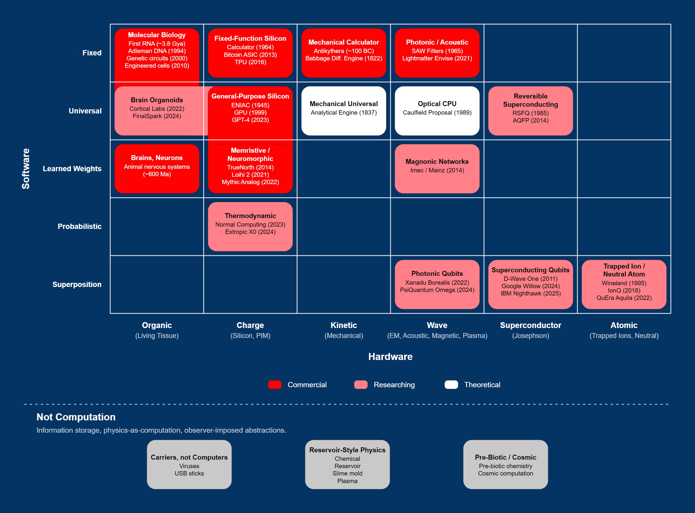
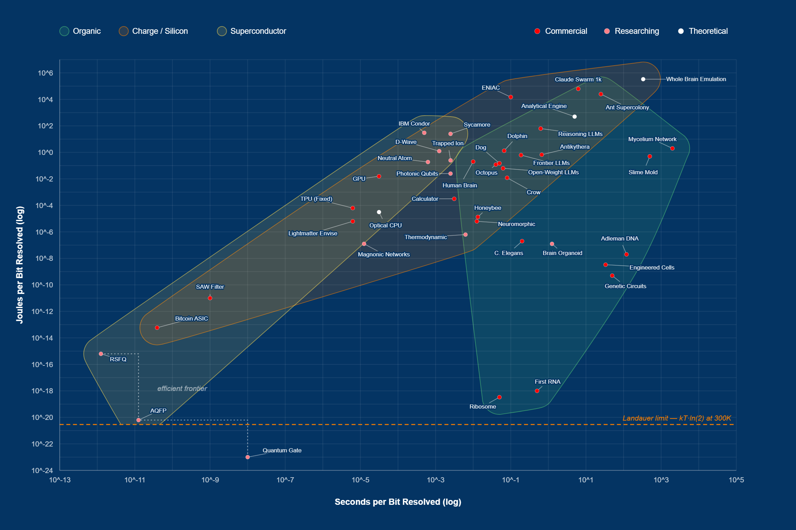

# The-Efficient-Frontier-of-Compute

The frontier of artificial intelligence lies with efficiency.

[Observable link]([https://observablehq.com/@nbm/efficient-frontier-of-compute](https://observablehq.com/d/f0c2c2eba5698489))

## Overview

Two interactive visualizations accompanying [The Efficient Frontier of Compute]([https://northbranchmedia.substack.com/](https://northbranchmedia.substack.com/p/the-efficient-frontier-of-compute)) published by North Branch Media. The piece argues that closing the energy efficiency gap between biological and artificial intelligence is the most valuable opportunity in the field, and maps every category of computation humanity has built across both its physical substrates and algorithmic paradigms.

### Taxonomy of Compute

Matrix categorizing every computational paradigm across two axes: hardware substrate (Organic, Charge, Kinetic, Wave, Superconductor, Atomic) and software paradigm (Fixed, Universal, Learned Weights, Probabilistic, Superposition). Each cell captures canonical implementations and first-demonstration dates. Color-coded by maturity (Commercial, Researching, Theoretical). A "Not Computation" appendix flags information storage, reservoir-style physics, and pre-biotic/cosmic processes as adjacent-but-distinct phenomena. Built with D3.js.

### Efficient Frontier of Compute

Interactive scatter plot estimating the energy (joules per bit) and time (seconds per bit) required to resolve one bit of uncertainty across forty-plus substrates from the taxonomy. Both axes are logarithmic, spanning roughly twenty orders of magnitude. The dashed amber line marks the Landauer limit (kT·ln(2) at 300K) — the thermodynamic floor for irreversible computation. The dotted staircase traces the efficient frontier: the set of substrates where no other system resolves a bit in both less time and less energy. Quantum gates sit below the Landauer line because unitary operations are reversible by construction, with the irreversible cost paid only at measurement. Built with D3.js.

## Data

Primary sources for energy, timing, and first-demonstration estimates:

**Hardware**
- [Jouppi et al. (2017)](https://arxiv.org/abs/1704.04760) — In-Datacenter Performance Analysis of a Tensor Processing Unit, *ISCA*
- [Merolla et al. (2014)](https://doi.org/10.1126/science.1254642) — A million spiking-neuron integrated circuit with a scalable communication network, *Science*
- [Madsen et al. (2022)](https://doi.org/10.1038/s41586-022-04725-x) — Quantum computational advantage with a programmable photonic processor, *Nature*
- [Arute et al. (2019)](https://doi.org/10.1038/s41586-019-1666-5) — Quantum supremacy using a programmable superconducting processor, *Nature*
- [Monroe et al. (1995)](https://doi.org/10.1103/PhysRevLett.75.4714) — Demonstration of a Fundamental Quantum Logic Gate, *Physical Review Letters*
- [Ebadi et al. (2021)](https://doi.org/10.1038/s41586-021-03582-4) — Quantum phases of matter on a 256-atom programmable quantum simulator, *Nature*
- Takeuchi et al. — Adiabatic quantum flux parametron as an ultra-low-power logic device, *Superconductor Science and Technology*
- [Likharev & Semenov (1991)](https://doi.org/10.1109/77.80745) — RSFQ logic/memory family, *IEEE Transactions on Applied Superconductivity*

**Biology**
- [Adleman (1994)](https://doi.org/10.1126/science.7973651) — Molecular computation of solutions to combinatorial problems, *Science*
- [Elowitz & Leibler (2000)](https://doi.org/10.1038/35002125) — A synthetic oscillatory network of transcriptional regulators, *Nature*
- [Gibson et al. (2010)](https://doi.org/10.1126/science.1190719) — Creation of a bacterial cell controlled by a chemically synthesized genome, *Science*
- [White et al. (1986)](https://doi.org/10.1098/rstb.1986.0056) — The structure of the nervous system of the nematode *Caenorhabditis elegans*, *Philosophical Transactions of the Royal Society B*
- [Kagan et al. (2022)](https://doi.org/10.1016/j.neuron.2022.09.001) — In vitro neurons learn and exhibit sentience when embodied in a simulated game-world, *Neuron*

**Hypercomputation** (excluded from the frontier; treated as "Not Computation")
- Pitowsky — the physical Church thesis
- Hogarth — Malament-Hogarth spacetimes
- Hamkins & Lewis — infinite-time Turing machines

**Thermodynamic foundation**
- [Landauer (1961)](https://doi.org/10.1147/rd.53.0183) — Irreversibility and Heat Generation in the Computing Process, *IBM Journal of Research and Development*

**Conceptual framework**
- [Stanford Encyclopedia of Philosophy — The Computational Theory of Mind (2024)](https://plato.stanford.edu/entries/computational-mind/)
- [Stanford Encyclopedia of Philosophy — Computation in Physical Systems (2025)](https://plato.stanford.edu/entries/computation-physicalsystems/)

## Visualization

Both visualizations are housed in [Observable]([https://observablehq.com/d/NOTEBOOK_ID](https://observablehq.com/d/f0c2c2eba5698489)) using **D3.js**.

## License

MIT License — free to reuse with attribution.

## Credits

- Visualizations built with **D3.js** in Observable
- Published by [North Branch Media](https://northbranchmedia.substack.com/)
